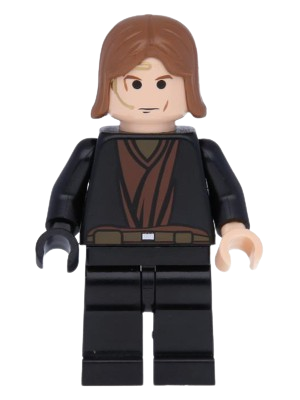

# tiosbriskeis-2024.1

## EC46C - Desenvolvimento Ágil - C61 (2024_01)

- Guilherme Yuuki Sumita - Anakin Lego
- Filipe Antonio de Lima Nogueira - Designer Desktop
- Pedro Augusto de Lima Oliveira - Developer
- Paulo Cesar de Oliveira Mitsi - Assistent
- Fernando Lima Fernandes - Assistent 
- João Victor da Cruz Silvestre - Designer Mobile

## O que é o projeto LP de sorveteria ?

> Uma página Web que tem o intuito de divulgar e alavancar as vendas de uma sorveteria. Nela vai ser passado as informações básicas e como entrar em contato.

## Tech

A LP vai usar as seguintes tecnologias:

- [HTML] - Linguagem de Marcação de HiperTexto
- [CSS] - Cascading Style Sheets

## Documentos encontrados no repositório

| Documento |  |
| ------ | ------ |
| Requisitos de Usuário | [https://github.com/G2454/tiosbriskeis-2024.1/tree/main/Requisitos%20do%20Usu%C3%A1rio] |
| Requisitos de Sistema | [https://github.com/G2454/tiosbriskeis-2024.1/tree/main/Requisitos%20do%20Sistema] |
